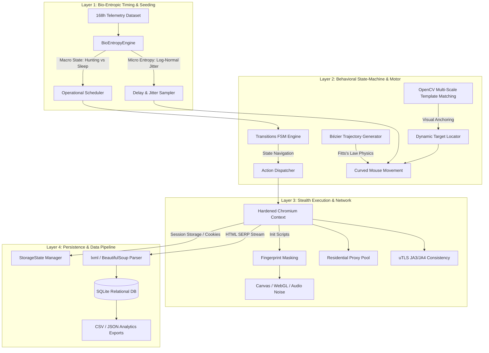

# Bio-Entropic Web Data Collection & Competitive Market Analysis Framework

A production-grade, stealth web data collection and competitive market intelligence framework powered by biological telemetry, non-linear human physics, and anti-detection browser sandboxing.

Unlike traditional bots that rely on rigid linear loops or predictable pseudo-random number generators (PRNG), this system is driven by a **Bio-Entropic State Engine**. It ingests real biological telemetry/etological datasets (e.g., 168-hour circadian rhythms and actigraphic movement logs) to dictate macroscopic operation schedules and microscopic entropy (jitter, dwell times, state transitions), ensuring statistical and behavioral indistinguishability from organic human activity.

---

## 🏛 System Architecture

The framework is organized into four cleanly decoupled layers:



---

## 🔬 Deep-Dive Module Breakdown

### 1. Bio-Entropic Timing & Seeding Engine (`src/bio_engine.py`)
- **Macro-Scale Entropy:** Ingests 168-hour (7-day) biological actigraphy time-series. Evaluates the multi-day biological rhythm to partition execution into active **Hunting/Exploration** periods and quiet **Digesting/Resting** sleep phases where request volume throttles to zero or passive background reading.
- **Micro-Scale Entropy:** Sampled from skewed log-normal distributions parameterized by current metabolic/activity levels. Eliminates linear delays (`time.sleep(2)`) and uniform PRNG signatures (`random.uniform(1, 3)`).

### 2. Stochastic State Machine & Behavioral Motor (`src/behavioral_motor.py`)
- **Finite State Machine:** Built on `transitions` to manage discrete human mental states:
  - `IDLE`: Session dormant.
  - `EXPLORING`: Broad category browsing and landing page discovery.
  - `SEARCHING`: Intent-driven keyword query formulation and input.
  - `READING`: Ingesting content with variable cognitive dwell times.
  - `ENTROPY_REST`: Simulated micro-distraction breaks (stepping away from keyboard).
- **Bézier Trajectory Math:** Generates high-order Bézier curves with randomized control points and Fitts's Law / Minimum-Jerk velocity profiles ($S$-curve ease-in/ease-out) with neuromuscular tremor noise.
- **Computer Vision Anchoring:** Uses OpenCV multi-scale normalized cross-correlation (`cv2.matchTemplate`) to visually locate search boxes, buttons, and UI elements, bypassing fragile XPath structures.

### 3. Low-Level Stealth Execution Layer (`src/stealth_layer.py`)
- **Fingerprint Evasion:** Strips `navigator.webdriver`, mocks hardware specs (`hardwareConcurrency: 8`, `deviceMemory: 8`), and injects subtle, imperceptible noise perturbations into HTML Canvas `toDataURL`, AudioContext buffer readings, and WebGL renderer strings.
- **Biometric Input Emulation:** Converts keystrokes and clicks into human neuromuscular events with pre-click dwell, keydown/keyup timing variances, and mousewheel stepped scrolling.
- **Proxy Synchronization:** Manages residential proxy IP rotation strictly during macroscopic biological rest phases.

### 4. Persistence & Market Intelligence Pipeline (`src/data_pipeline.py`)
- **Session Continuity:** Employs Playwright `storage_state` to persistently store cookies, local storage, and authentication tokens across restarts, eliminating the "clean slate" anomaly.
- **Data Model:** Structured SQLite schema managing products (`asin`, `title`, `brand`, `rating`, `category`), historical price snapshots (`price`, `currency`, `snapshot_time`), and sentiment reviews.
- **Downstream Analytics:** Automated export to structured CSV and JSON datasets.

---

## 🚀 Installation & Quick Start

### 1. Prerequisites
- Python 3.11+
- Chrome / Chromium binaries (handled via Playwright)

### 2. Setup Environment
```bash
# Clone or navigate to the repository
cd _amazon

# Install dependencies
pip install -r requirements.txt

# Install Playwright browser binaries
playwright install chromium
```

### 3. Run Self-Test & Diagnostic Demo
Verify that the bio-entropy calculations, Bézier curves, FSM, and database pipeline are fully operational:
```bash
python demo.py
```

### 4. Run Market Intelligence Collection Cycle
```bash
python -m src.orchestrator
```

---

## ⚙️ Configuration (`src/config.py`)

All operational parameters can be customized programmatically or via environment variables:

```python
from src.config import AppConfig

config = AppConfig.load_default()

# Configure Residential Proxy Pool
config.proxy.enabled = True
config.proxy.server = "http://residential.proxy-provider.com:8000"
config.proxy.username = "proxy_user"
config.proxy.password = "proxy_pass"

# Configure Browser & Viewport
config.browser.headless = False  # Set to True for headless servers
config.browser.viewport_width = 1920
config.browser.viewport_height = 1080

# Tune Biological Timing
config.bio.macro_cycle_hours = 168
config.bio.active_threshold = 0.45
config.bio.micro_jitter_std = 0.25
```

---

## 📊 Database Schema

```sql
-- Core Product Registry
CREATE TABLE products (
    asin TEXT PRIMARY KEY,
    title TEXT NOT NULL,
    brand TEXT,
    rating REAL,
    ratings_count INTEGER,
    canonical_url TEXT,
    prime_eligible INTEGER,
    category TEXT,
    created_at TIMESTAMP DEFAULT CURRENT_TIMESTAMP,
    updated_at TIMESTAMP DEFAULT CURRENT_TIMESTAMP
);

-- Time-Series Price History Snapshots
CREATE TABLE price_history (
    id INTEGER PRIMARY KEY AUTOINCREMENT,
    asin TEXT NOT NULL,
    price REAL NOT NULL,
    currency TEXT DEFAULT 'USD',
    availability TEXT,
    snapshot_time TIMESTAMP DEFAULT CURRENT_TIMESTAMP,
    FOREIGN KEY (asin) REFERENCES products(asin)
);
```

---

## 🛡️ Operational Ethics & Resilience

- **Fail-Safe Fallbacks:** All network anomalies, CAPTCHA appearances, and timeout spikes gracefully downgrade the state machine into an extended `ENTROPY_REST` or `IDLE` state rather than throwing fatal unhandled exceptions.
- **Rate-Limit Preservation:** Biological sleep intervals naturally preserve server bandwidth and honor upstream operational health.
