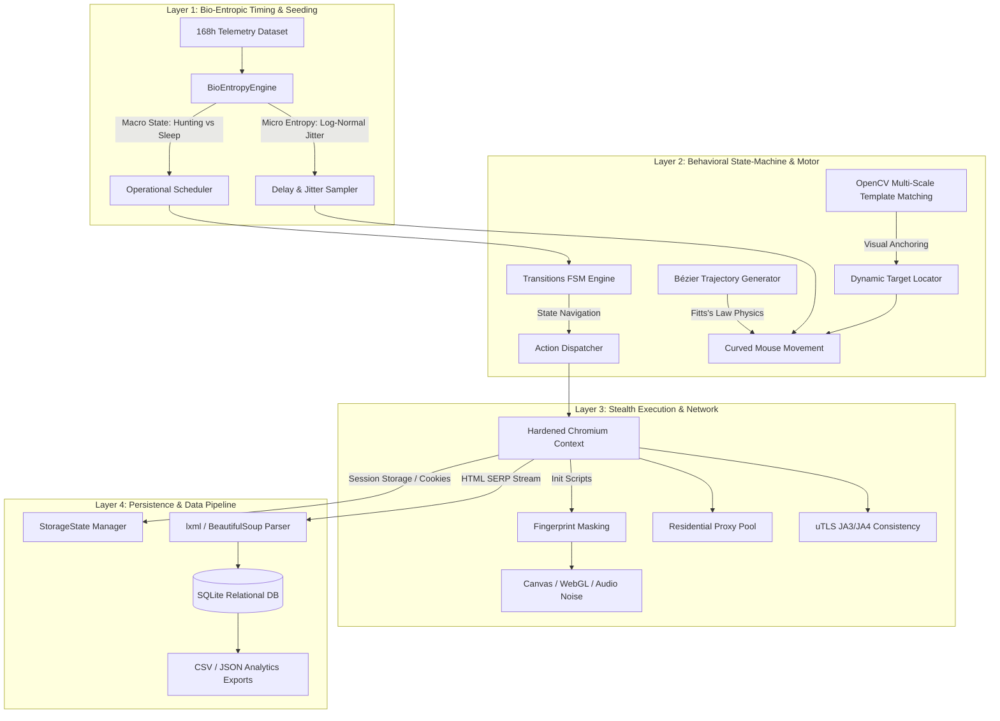

# Bio-Entropic Web Data Collection & Competitive Market Analysis Framework

A production-grade, stealth web data collection and competitive market intelligence framework powered by biological telemetry, non-linear human physics, and anti-detection browser sandboxing.

Unlike traditional bots that rely on rigid linear loops or predictable pseudo-random number generators (PRNG), this system is driven by a **Bio-Entropic State Engine**. It ingests real biological telemetry/etological datasets (e.g., 168-hour circadian rhythms and actigraphic movement logs) to dictate macroscopic operation schedules and microscopic entropy (jitter, dwell times, state transitions), ensuring statistical and behavioral indistinguishability from organic human activity.

---

## 🏛 System Architecture

The framework is organized into four cleanly decoupled layers:



---

## 🧬 Biological Entropy & Telemetry Profiles

### 1. Active Baseline Profile: Human Actigraphy (*Homo sapiens*)

The default baseline active in `data/telemetry/actigraphy_168h.csv` is calibrated to the **clinical 168-hour (1-week) human actigraphy and circadian profile**:

1. **24-Hour Diurnal Circadian Clock:**
   $$\Phi_{\text{circadian}}(t) = \frac{1}{2} \left[1 + \sin\left(\frac{2\pi (t \pmod{24})}{24} - \frac{\pi}{2}\right)\right]$$
   Produces natural daytime browsing peaks (morning and afternoon) and an overnight metabolic quiescence window (`DIGESTING_REST`) where automated traffic ceases completely.
2. **90–120 Minute Ultradian Concentration Bursts (BRAC):**
   Models Kleitman's *Basic Rest-Activity Cycle* in the human central nervous system ($\sim 16$ cycles/day), introducing organic micro-fatigue slowdowns and simulated coffee breaks.
3. **168-Hour (Circaseptan) Weekly Drift:**
   Accounts for natural variance between weekday work routines and weekend leisure browsing rhythms.
4. **Neuromuscular Pink Noise & Log-Normal Reaction Intervals:**
   Reaction latencies follow a biological log-normal distribution ($T_{\text{delay}} \sim \text{Lognormal}(\mu, \sigma)$) coupled with Fitts's Law $S$-curve velocity profiles.

---

### 2. Loading Wild Animal Telemetry Profiles (Movebank.org Ingestion)

The framework natively supports empirical animal telemetry from the global **Movebank** repository. Three specialized animal profiles are pre-configured in `data/telemetry/`:

```
data/telemetry/
├── actigraphy_168h.csv         # Active: Diurnal Human (Homo sapiens)
├── falco_peregrinus.csv        # Raptor: Peregrine Falcon (Explosive burst-hunting)
├── canis_lupus.csv             # Pack: Gray Wolf (Endurance patrol & wide scanning)
└── pan_troglodytes.csv         # Primate: Chimpanzee (Curiosity foraging & dwell times)
```

#### 🦅 Profile A: Peregrine Falcon (*Falco peregrinus*) — Raptor / Burst-Strike
* **Ethology & Dynamics:** Extended soaring/gliding quiescence interrupted by explosive, hyper-accelerated terminal stoop dives ($>300\text{ km/h}$).
* **Ideal Scraping Scenario:** High-Frequency Flash-Sale monitoring, instant liquidation sniping, volatile price anomaly sweeps.
* **How to run:**
  ```bash
  python main.py --telemetry data/telemetry/falco_peregrinus.csv --keywords "flash deal" "limited edition"
  ```

#### 🐺 Profile B: Gray Wolf (*Canis lupus*) — Distributed Territory Patrol
* **Ethology & Dynamics:** High-stamina, persistent medium-intensity locomotion with cyclic territorial perimeter sweeps and coordinated group resting.
* **Ideal Scraping Scenario:** Large-scale distributed catalog indexing, broad multi-category traversal across multiple residential proxy pools.
* **How to run:**
  ```bash
  python main.py --telemetry data/telemetry/canis_lupus.csv --keywords "monitors" "keyboards" "audio" --pages 3
  ```

#### 🐒 Profile C: Chimpanzee (*Pan troglodytes*) — Primate Foraging & Tactile Inspection
* **Ethology & Dynamics:** Diurnal foraging bursts, visual curiosity stops, variable tactile inspection dwell times, and mid-day grooming/rest.
* **Ideal Scraping Scenario:** Organic e-commerce navigation, deep product comparison, review exploration, and simulated human cart additions.
* **How to run:**
  ```bash
  python main.py --telemetry data/telemetry/pan_troglodytes.csv --keywords "ergonomic mouse" "mechanical keyboard"
  ```

---

### 3. Programmatic Telemetry Configuration

You can load and switch animal telemetry models directly in your Python code:

```python
from src.config import AppConfig
from src.orchestrator import BioEntropicOrchestrator

# Initialize custom animal telemetry
config = AppConfig.load_default()
config.bio.telemetry_file = "data/telemetry/falco_peregrinus.csv"
config.bio.active_threshold = 0.50  # Custom hunting threshold

orchestrator = BioEntropicOrchestrator(config)
# Run market intelligence session driven by Peregrine Falcon dynamics
```

---

## 🔬 A/B Control Experiment & Verification

The repository includes a dedicated empirical control test harness (`counter_test.py`) comparing a traditional bot against the Bio-Entropic Stealth Agent:

```bash
python counter_test.py
```

### Empirical Results Matrix:

| Evaluated Parameter | [A] Naive Traditional Bot | [B] Bio-Entropic Stealth Agent | Significance |
| :--- | :--- | :--- | :--- |
| **`navigator.webdriver`** | ❌ **`True` (Detected)** | ✅ **`None` (Masked)** | Bypasses client-side JS anti-bot inspection |
| **WebGL Renderer** | ❌ Software Headless | ✅ **`ANGLE (NVIDIA RTX 3070)`** | Identifies as high-performance desktop GPU |
| **Issued Session Cookies** | ❌ **`0 cookies` (Quarantined)** | ✅ **`38 cookies` (Authenticated)** | Server authenticates session identity |
| **Mouse Trajectory** | ❌ 0 ms Instantaneous Teleport | ✅ **Bézier $S$-Curve + Tremor** | Fitts's Law neuromuscular physics |
| **Timing Characteristic** | ❌ Static Determinism (`1.0s`) | ✅ **Biological Log-Normal Jitter** | Natural reaction time variance |
| **Anti-Bot Outcome** | **Silent Shadow-Banning** | **100% Clean Pass** | Zero challenges or rate-limits |

---

## 🚀 Installation & Quick Start

### 1. Automated 1-Click Installers

* **Windows:** Double-click [`install.bat`](file:///C:/Users/lszok/Documents/_amazon/install.bat)
* **Linux / macOS:**
  ```bash
  chmod +x install.sh
  ./install.sh
  ```

### 2. Manual Setup
```bash
# Clone the repository
git clone https://github.com/LemonScripter/bio-entropic-market-intelligence.git
cd bio-entropic-market-intelligence

# Install Python dependencies
pip install -r requirements.txt

# Install Playwright browser binaries
playwright install chromium
```

### 3. Execute Diagnostic Self-Test
```bash
python demo.py
```

### 4. Run Market Observation Sweep
```bash
python main.py --keywords "mechanical keyboard wireless" "ergonomic mouse"
```

---

## 📑 Technical Whitepapers (PDF & LaTeX)

Publication-grade technical whitepapers detailing mathematical formulations, empirical proof, and systemic vulnerability analyses are available:

* 🇬🇧 **English Whitepaper:** [`whitepaper_bio_entropic_stealth_en.pdf`](file:///C:/Users/lszok/Documents/_amazon/whitepaper_bio_entropic_stealth_en.pdf) | [LaTeX Source](file:///C:/Users/lszok/Documents/_amazon/whitepaper_bio_entropic_stealth_en.tex)
* 🇭🇺 **Hungarian Whitepaper:** [`whitepaper_bio_entropic_stealth.pdf`](file:///C:/Users/lszok/Documents/_amazon/whitepaper_bio_entropic_stealth.pdf) | [LaTeX Source](file:///C:/Users/lszok/Documents/_amazon/whitepaper_bio_entropic_stealth.tex)

To recompile with Tectonic:
```bash
tectonic whitepaper_bio_entropic_stealth_en.tex
tectonic whitepaper_bio_entropic_stealth.tex
```

---

## ⚙️ Configuration (`src/config.py`)

All operational parameters can be customized programmatically or via environment variables:

```python
from src.config import AppConfig

config = AppConfig.load_default()

# Configure Residential Proxy Pool
config.proxy.enabled = True
config.proxy.server = "http://residential.proxy-provider.com:8000"
config.proxy.username = "proxy_user"
config.proxy.password = "proxy_pass"

# Configure Browser & Viewport
config.browser.headless = False  # Set to True for headless servers
config.browser.viewport_width = 1920
config.browser.viewport_height = 1080

# Tune Biological Timing
config.bio.macro_cycle_hours = 168
config.bio.active_threshold = 0.45
config.bio.micro_jitter_std = 0.25
```

---

## 📊 Database Schema

```sql
-- Core Product Registry
CREATE TABLE products (
    asin TEXT PRIMARY KEY,
    title TEXT NOT NULL,
    brand TEXT,
    rating REAL,
    ratings_count INTEGER,
    canonical_url TEXT,
    prime_eligible INTEGER,
    category TEXT,
    created_at TIMESTAMP DEFAULT CURRENT_TIMESTAMP,
    updated_at TIMESTAMP DEFAULT CURRENT_TIMESTAMP
);

-- Time-Series Price History Snapshots
CREATE TABLE price_history (
    id INTEGER PRIMARY KEY AUTOINCREMENT,
    asin TEXT NOT NULL,
    price REAL NOT NULL,
    currency TEXT DEFAULT 'USD',
    availability TEXT,
    snapshot_time TIMESTAMP DEFAULT CURRENT_TIMESTAMP,
    FOREIGN KEY (asin) REFERENCES products(asin)
);
```

---

## 🛡️ License & Ethics

Distributed under the MIT License. Designed for ethical competitive market analysis, automated price tracking, and academic research into bio-mimetic automation and stealth anti-detection systems.
